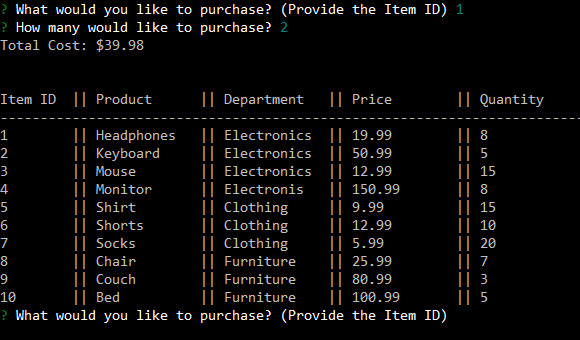

# Bamazon

To run the script, you will need to install the 'mysql' and 'inquirer'packages
```
$ npm install mysql --save 
```

```
$ npm install inquirer --save
```

When you first run the program, a list of available items will be displayed and you will be prompted with questions regarding a purchase.


After selecting a valid item and quantity, you will be given the total cost.


An updated table of items will be displayed again if you want to continue with another purchase.
The previous purchase inlcuded item 1 with a quantity of 2. Therefore the update table shows a change
in stock quantity from 10 to 8.



If you try to purchase an amount greater than the current stock quantity, your purchase will not go through and you must order again.


